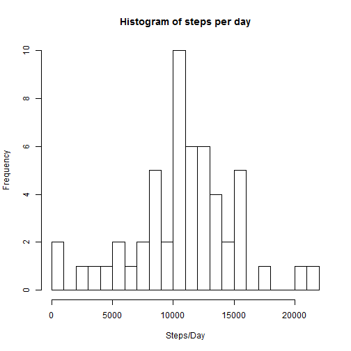
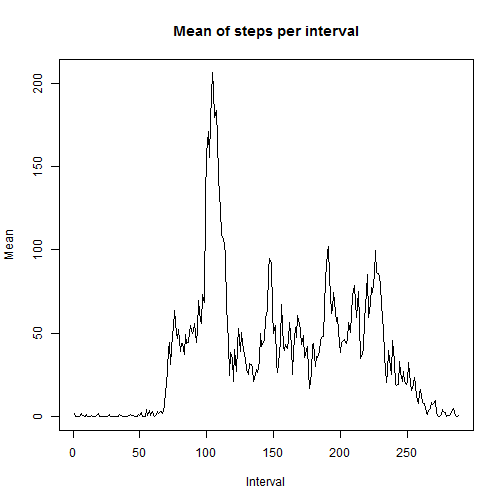
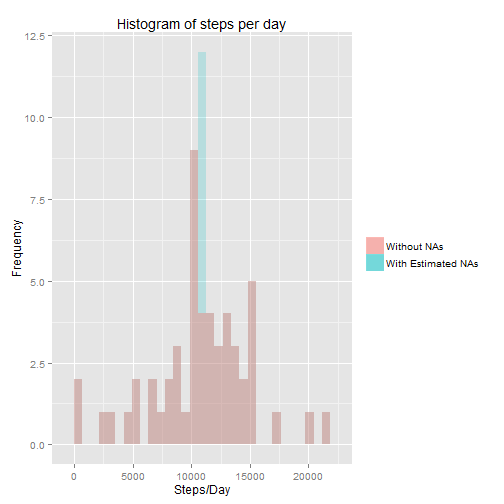
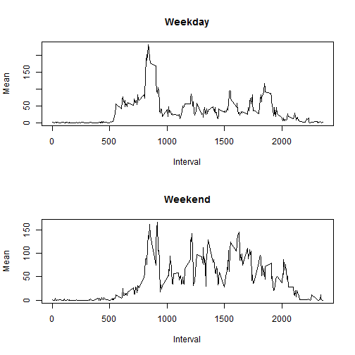

# Reproducible Research: Peer Assessment 1


## Loading and preprocessing the data


```r
unzip("activity.zip")
data <- read.csv("activity.csv")
data$date <- as.Date(data$date)
completedData <- data[complete.cases(data),]
```

## What is mean total number of steps taken per day?


```r
stepsperday <- tapply(completedData$steps, completedData$date, sum)
mean <- mean(stepsperday)
median <- median(stepsperday)
hist(stepsperday, main = "Histogram of steps per day", breaks = 20, xlab = "Steps/Day")
```

 

The mean of steps per day is 1.0766 &times; 10<sup>4</sup>

The median of steps per day is 10765

## What is the average daily activity pattern?


```r
meanstepsperinterval <- tapply(completedData$steps, completedData$interval, mean)
maxvalue <- max(meanstepsperinterval)
maxnameinterval <- names(which.max(meanstepsperinterval))
maxindexinterval <- which.max(meanstepsperinterval)[[1]]
plot(meanstepsperinterval, type = "l", main = "Mean of steps per interval", xlab = "Interval", ylab = "Mean")
```

 

The max value of the mean of steps is 206.1698 wich correspond with the interval 835 that has index 104

## Imputing missing values

To fill missing data I used the mean of steps per interval


```r
missingvalues <- nrow(data) - nrow(completedData)

uncompletedData <- data[!complete.cases(data),]
dataaux <- merge(uncompletedData, as.data.frame(meanstepsperinterval), by.x = "interval", by.y = "row.names")
missingData <- data.frame(dataaux$meanstepsperinterval, dataaux$date, dataaux$interval)
names(missingData) <- c("steps", "date", "interval")
missingData <- missingData[order(missingData$date),]
newData <- rbind(missingData, completedData)

newstepsperday <- tapply(newData$steps, newData$date, sum)
newmean <- mean(newstepsperday)
newmedian <- median(newstepsperday)
```

Total number of missing values is 2304

The mean of steps per day without NAs is 1.0766 &times; 10<sup>4</sup> and with NAs is 1.0766 &times; 10<sup>4</sup>

The median of steps per day without NAs is 10765 and with NAs is 1.0766 &times; 10<sup>4</sup>


```r
library(ggplot2)
DF <- rbind(data.frame(missing="true", obs=newstepsperday),
            data.frame(missing="false", obs=stepsperday))

ggplot(DF,aes(x=obs, fill = missing, group = missing)) + 
        geom_histogram(data=subset(DF,missing == "true"), alpha = 0.2, binwidth = diff(range(DF$obs))/30) +
        geom_histogram(data=subset(DF,missing == "false"), alpha = 0.4, binwidth = diff(range(DF$obs))/30) +
        xlab("Steps/Day") +
        ylab("Frequency") +
        ggtitle("Histogram of steps per day") +
        scale_fill_discrete(name="", labels=c("Without NAs", "With Estimated NAs"))
```

 

## Are there differences in activity patterns between weekdays and weekends?


```r
Sys.setlocale("LC_TIME", "English")
```


```r
day <- as.factor(weekdays(newData$date) == "Saturday" | weekdays(newData$date) == "Sunday")
levels(day) <- c("weekday", "weekend")
newData$day <- day
meanstepsperintervalandday <- data.frame(tapply(newData$steps, list(newData$interval, newData$day), mean))
meanstepsperintervalandday$interval <- rownames(meanstepsperintervalandday)
par(mfrow=c(2,1))
plot(meanstepsperintervalandday$interval, meanstepsperintervalandday$weekday, type = "l", main = "Weekday", xlab = "Interval", ylab = "Mean")
plot(meanstepsperintervalandday$interval, meanstepsperintervalandday$weekend, type = "l", main = "Weekend", xlab = "Interval", ylab = "Mean")
```

 
